# Manual Técnico - SmartCity Tech Park

**Angel Emanuel Rodriguez Corado - 202404856**

------------------------------------------------------------------------

# 1. Capturas de topología completa y cada área

> **CAPTURA 1:** Topología completa de SmartCity Tech Park.
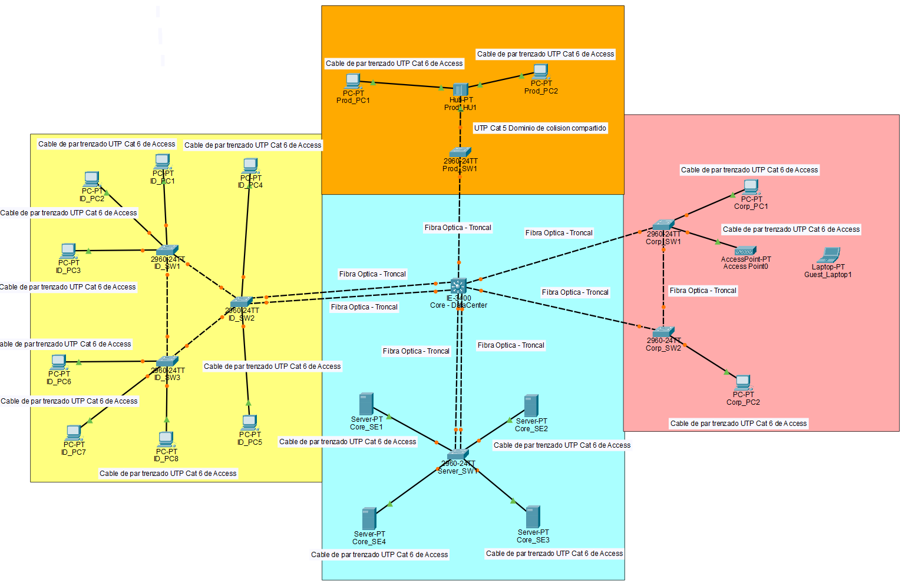

> **CAPTURA 2:** Área de Investigación y Desarrollo (I+D).
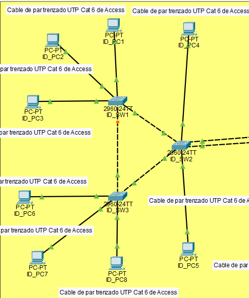

> **CAPTURA 3:** Área de Data Center.
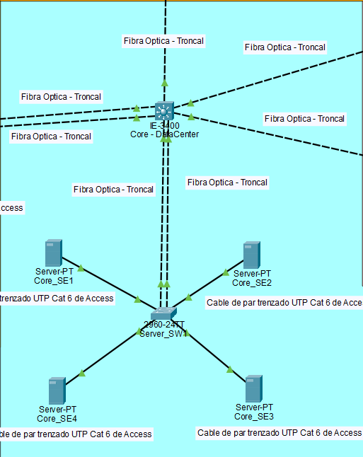

> **CAPTURA 4:** Área de Producción y segmento Legacy con Hub.
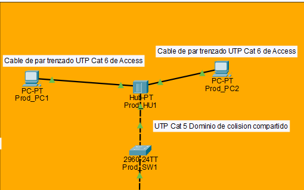

> **CAPTURA 5:** Área Corporativa.
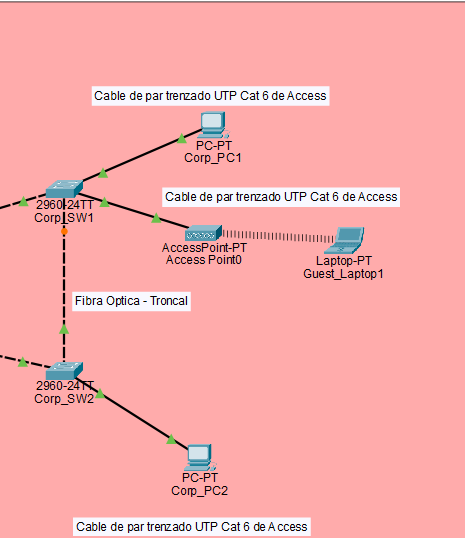

------------------------------------------------------------------------

# 2. Tabla de dominios de colisión

En los enlaces conectados directamente a switches, cada segmento físico
constituye un dominio de colisión independiente. En Producción,
`Prod_HU1` genera un único dominio de colisión compartido entre los
dispositivos conectados al Hub y el puerto `Fa0/2` de `Prod_SW1`.

| Switch | Puertos activos | Cantidad de puertos activos |
| --- | --- | --- |
| Core-DataCenter | Gi1/3, Gi1/4, Gi1/5, Gi1/6, Gi1/7, Gi1/8, Gi1/9 | 7 |
| ID_SW1 | Fa0/1, Fa0/2, Fa0/3, Fa0/4, Fa0/5 | 5 |
| ID_SW2 | Fa0/1, Fa0/2, Fa0/3, Fa0/4, Fa0/5, Fa0/6 | 6 |
| ID_SW3 | Fa0/1, Fa0/2, Fa0/3, Fa0/4, Fa0/5 | 5 |
| Server_SW1 | Fa0/1, Fa0/2, Fa0/3, Fa0/4, Fa0/5, Fa0/6 | 6 |
| Prod_SW1 | Fa0/1, Fa0/2 | 2 |
| Corp_SW1 | Fa0/1, Fa0/2, Fa0/3, Fa0/4 | 4 |
| Corp_SW2 | Fa0/1, Fa0/2, Fa0/3 | 3 |

## Dominio de colisión compartido del segmento Legacy

| Segmento | Dispositivos incluidos | Dominio |
| --- | --- | --- |
| Producción Legacy | Prod_PC1, Prod_PC2, Prod_HU1 y Fa0/2 de Prod_SW1 | 1 dominio de colisión compartido |

> **CAPTURA 6:** Segmento Legacy completo:
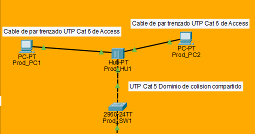


> **CAPTURA 7:** 
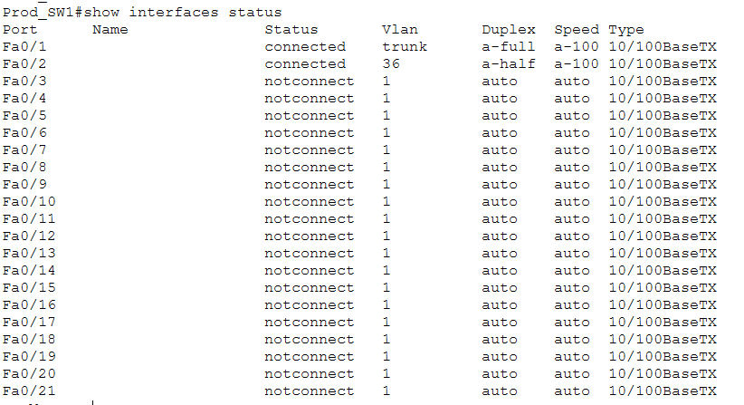

> **CAPTURA 8:** 
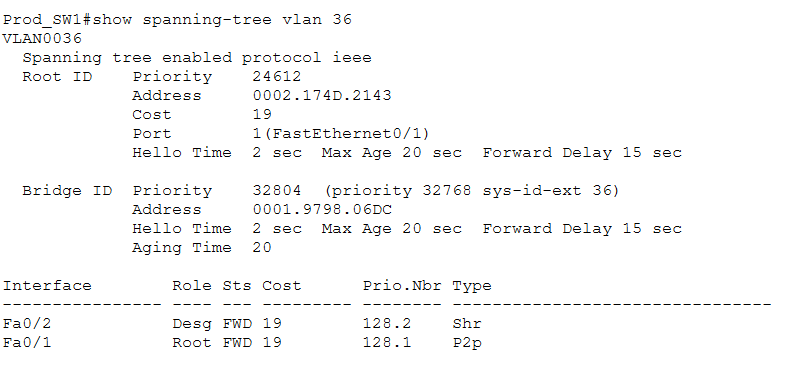

------------------------------------------------------------------------

# 3. Tabla de dominios de broadcast

| Dominio de Broadcast | VLAN ID | Nombre |
| --- | --- | --- |
| 1 | 16 | GERENCIA |
| 2 | 26 | INVESTIGACION |
| 3 | 36 | PRODUCCION |
| 4 | 46 | SERVIDORES |
| 5 | 56 | VISITANTES |
| 6 | 96 | NATIVA |

**Total: 6 dominios de broadcast correspondientes a las VLAN activas del
proyecto.**

> **CAPTURA 9:** `show vlan brief` en `Core-DataCenter`
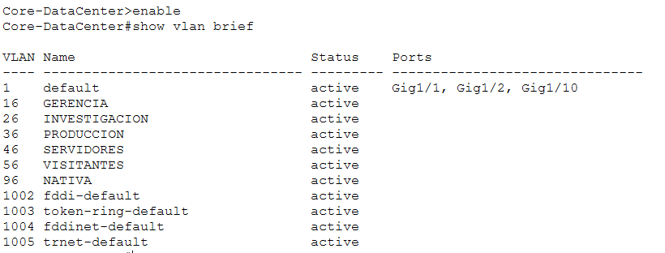

------------------------------------------------------------------------

# 4. Tabla de VLANs

| VLAN ID | Nombre |
| --- | --- |
| 16 | GERENCIA |
| 26 | INVESTIGACION |
| 36 | PRODUCCION |
| 46 | SERVIDORES |
| 56 | VISITANTES |
| 96 | NATIVA |

------------------------------------------------------------------------

# 5. Tabla de asignación de puertos por switch

## Core-DataCenter

| Puerto | Conexión | Configuración |
| --- | --- | --- |
| Gi1/3 | Corp_SW2 Fa0/1 | Trunk, VLAN nativa 96 |
| Gi1/4 | Corp_SW1 Fa0/1 | Trunk, VLAN nativa 96 |
| Gi1/5 | Server_SW1 Fa0/1 | Po2 - LACP |
| Gi1/6 | Server_SW1 Fa0/2 | Po2 - LACP |
| Gi1/7 | ID_SW2 Fa0/1 | Po1 - LACP |
| Gi1/8 | ID_SW2 Fa0/2 | Po1 - LACP |
| Gi1/9 | Prod_SW1 Fa0/1 | Trunk, VLAN nativa 96 |

## ID_SW1

| Puerto | Conexión | Configuración |
| --- | --- | --- |
| Fa0/1 | ID_SW2 Fa0/5 | Trunk, VLAN nativa 96 |
| Fa0/2 | ID_SW3 Fa0/2 | Trunk, VLAN nativa 96 |
| Fa0/3 | ID_PC1 | Access VLAN 26 |
| Fa0/4 | ID_PC2 | Access VLAN 26 |
| Fa0/5 | ID_PC3 | Access VLAN 26 |

## ID_SW2

| Puerto | Conexión | Configuración |
| --- | --- | --- |
| Fa0/1 | Core-DataCenter Gi1/7 | Po1 - LACP |
| Fa0/2 | Core-DataCenter Gi1/8 | Po1 - LACP |
| Fa0/3 | ID_PC4 | Access VLAN 26 |
| Fa0/4 | ID_PC5 | Access VLAN 26 |
| Fa0/5 | ID_SW1 Fa0/1 | Trunk, VLAN nativa 96 |
| Fa0/6 | ID_SW3 Fa0/1 | Trunk, VLAN nativa 96 |

## ID_SW3

| Puerto | Conexión | Configuración |
| --- | --- | --- |
| Fa0/1 | ID_SW2 Fa0/6 | Trunk, VLAN nativa 96 |
| Fa0/2 | ID_SW1 Fa0/2 | Trunk, VLAN nativa 96 |
| Fa0/3 | ID_PC6 | Access VLAN 26 |
| Fa0/4 | ID_PC7 | Access VLAN 26 |
| Fa0/5 | ID_PC8 | Access VLAN 26 |

## Server_SW1

| Puerto | Conexión | Configuración |
| --- | --- | --- |
| Fa0/1 | Core-DataCenter Gi1/5 | Po2 - LACP |
| Fa0/2 | Core-DataCenter Gi1/6 | Po2 - LACP |
| Fa0/3 | Core_SE1 | Access VLAN 46 |
| Fa0/4 | Core_SE2 | Access VLAN 46 |
| Fa0/5 | Core_SE3 | Access VLAN 46 |
| Fa0/6 | Core_SE4 | Access VLAN 46 |

## Prod_SW1

| Puerto | Conexión | Configuración |
| --- | --- | --- |
| Fa0/1 | Core-DataCenter Gi1/9 | Trunk, VLAN nativa 96 |
| Fa0/2 | Prod_HU1 | Access VLAN 36 |

## Corp_SW1

| Puerto | Conexión | Configuración |
| --- | --- | --- |
| Fa0/1 | Core-DataCenter Gi1/4 | Trunk, VLAN nativa 96 |
| Fa0/2 | Corp_SW2 Fa0/2 | Trunk, VLAN nativa 96 |
| Fa0/3 | Corp_PC1 | Access VLAN 16 |
| Fa0/4 | AccessPoint0 | Access VLAN 56 |

## Corp_SW2

| Puerto | Conexión | Configuración |
| --- | --- | --- |
| Fa0/1 | Core-DataCenter Gi1/3 | Trunk, VLAN nativa 96 |
| Fa0/2 | Corp_SW1 Fa0/2 | Trunk, VLAN nativa 96 |
| Fa0/3 | Corp_PC2 | Access VLAN 16 |

------------------------------------------------------------------------

# 6. Medios físicos utilizados

De acuerdo con la topología implementada:

| Tipo de conexión | Medio utilizado |
| --- | --- |
| Dispositivos finales hacia switches | Cable de par trenzado UTP Cat 6 de Access |
| Servidores hacia Server_SW1 | Cable de par trenzado UTP Cat 6 de Access |
| Corp_SW1 hacia AccessPoint0 | Cable de par trenzado UTP Cat 6 de Access |
| Prod_PC1 y Prod_PC2 hacia Prod_HU1 | Cable de par trenzado UTP Cat 6 de Access |
| Prod_HU1 hacia Prod_SW1 | UTP Cat 5 |
| Enlaces troncales entre switches | Fibra óptica - Troncal |
| Enlaces físicos de EtherChannel Po1 y Po2 | Fibra óptica - Troncal |

**Justificación:** se utiliza cable UTP en las conexiones de acceso
hacia dispositivos finales. Para los enlaces troncales entre switches se
utiliza fibra óptica, debido a que estos enlaces concentran el tráfico
entre las diferentes áreas de la red. El segmento Legacy utiliza un Hub
y mantiene el medio UTP indicado en la topología.

> **CAPTURA 10:** Topología completa mostrando las etiquetas de
> `Fibra Optica - Troncal`, `Cable de par trenzado UTP Cat 6 de Access`
> y `UTP Cat 5 Dominio de colision compartido`.


------------------------------------------------------------------------

# 7. VTP: servidor y justificación

El switch seleccionado como servidor VTP es:

``` text
Core-DataCenter
```

Configuración:

``` bash
vtp domain Smart_5
vtp password proyecto12S2026
vtp mode server
```

Los demás switches se configuraron como clientes VTP:

``` text
ID_SW1
ID_SW2
ID_SW3
Server_SW1
Prod_SW1
Corp_SW1
Corp_SW2
```

**Justificación:** `Core-DataCenter` se selecciona como servidor VTP
debido a que es el switch central de la topología y concentra los
enlaces troncales hacia los diferentes edificios. Las VLANs se crean en
este dispositivo y son propagadas a los switches cliente mediante el
dominio `Smart_5`.

> **CAPTURA 11:** `show vtp status` en `Core-DataCenter`
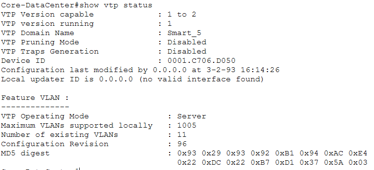

> **CAPTURA 12:** `show vtp status` en un switch cliente, mostrando
> `VTP Operating Mode: Client` y dominio `Smart_5`.
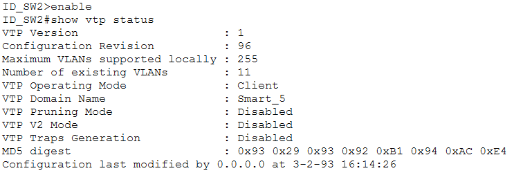

------------------------------------------------------------------------

# 8. Root Bridge por VLAN y justificación

Se selecciona `Core-DataCenter` como Root Bridge para las VLAN 16, 26,
36, 46, 56 y 96.

Configuración:

``` bash
spanning-tree mode pvst
spanning-tree vlan 16,26,36,46,56,96 root primary
```

| VLAN | Nombre | Root Bridge |
| --- | --- | --- |
| 16 | GERENCIA | Core-DataCenter |
| 26 | INVESTIGACION | Core-DataCenter |
| 36 | PRODUCCION | Core-DataCenter |
| 46 | SERVIDORES | Core-DataCenter |
| 56 | VISITANTES | Core-DataCenter |
| 96 | NATIVA | Core-DataCenter |

**Justificación:** `Core-DataCenter` funciona como punto central de la
topología y concentra los enlaces troncales hacia los edificios. Al
utilizarlo como Root Bridge, PVST calcula los caminos principales
tomando como referencia el núcleo de la red y mantiene los enlaces
redundantes como caminos alternativos cuando corresponde.

> **CAPTURA 13:** ejecutar `show spanning-tree` en `Core-DataCenter`
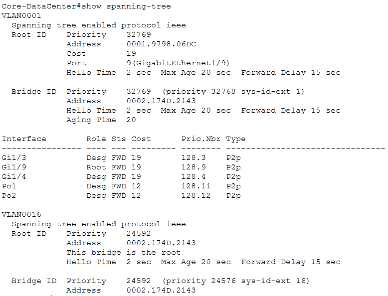

------------------------------------------------------------------------

# 9. EtherChannel utilizados y justificación

El carnet `202404856` termina en número par, por lo que se utiliza
**LACP**.

| EtherChannel | Conexión | Interfaces |
| --- | --- | --- |
| Po1 | Core-DataCenter ↔ ID_SW2 | Core Gi1/7-Gi1/8 ↔ ID_SW2 Fa0/1-Fa0/2 |
| Po2 | Core-DataCenter ↔ Server_SW1 | Core Gi1/5-Gi1/6 ↔ Server_SW1 Fa0/1-Fa0/2 |

**Justificación de Po1:** se utiliza EtherChannel con LACP en el enlace
entre el Core e I+D para agrupar dos conexiones físicas en un único
enlace lógico y proporcionar mayor capacidad al enlace de I+D.

**Justificación de Po2:** se utiliza EtherChannel con LACP entre el Core
y `Server_SW1` para que el enlace de los servidores no dependa de una
única conexión física.

> **CAPTURA 14:** `show etherchannel summary` en `Core-DataCenter`,
> mostrando `Po1(SU)` y `Po2(SU)` con protocolo LACP.
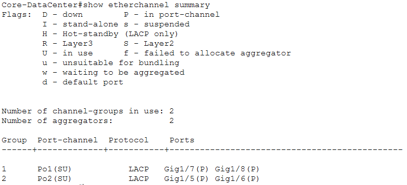

> **CAPTURA 15:** `show etherchannel summary` en `ID_SW2`, mostrando
> `Po1(SU)` y los puertos miembros `(P)`.
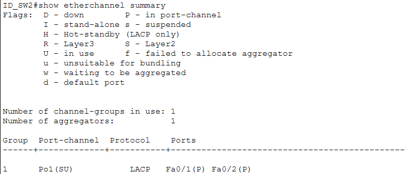

> **CAPTURA 16:** `show etherchannel summary` en `Server_SW1`, mostrando
> `Po2(SU)` y los puertos miembros `(P)`.
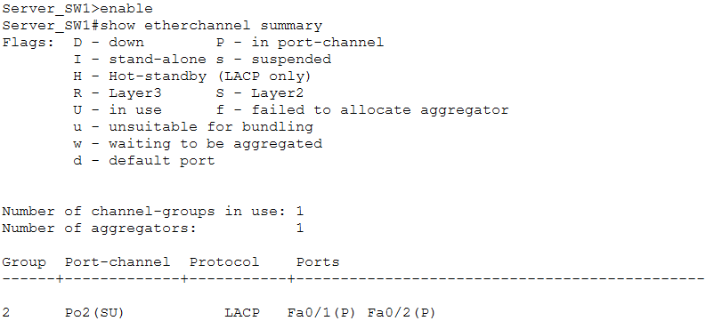

------------------------------------------------------------------------

# 10. Lista de comandos utilizados por dispositivo

## Core-DataCenter

``` bash
enable
configure terminal
hostname Core-DataCenter

vtp domain Smart_5
vtp password proyecto12S2026
vtp mode server

vlan 16
 name GERENCIA
 exit
vlan 26
 name INVESTIGACION
 exit
vlan 36
 name PRODUCCION
 exit
vlan 46
 name SERVIDORES
 exit
vlan 56
 name VISITANTES
 exit
vlan 96
 name NATIVA
 exit

interface range gigabitEthernet 1/7 - 8
 channel-group 1 mode active
 exit

interface port-channel 1
 switchport mode trunk
 switchport trunk native vlan 96
 exit

interface range gigabitEthernet 1/5 - 6
 channel-group 2 mode active
 exit

interface port-channel 2
 switchport mode trunk
 switchport trunk native vlan 96
 exit

interface gigabitEthernet 1/9
 switchport mode trunk
 switchport trunk native vlan 96
 exit

interface gigabitEthernet 1/4
 switchport mode trunk
 switchport trunk native vlan 96
 exit

interface gigabitEthernet 1/3
 switchport mode trunk
switchport trunk native vlan 96
 exit

spanning-tree mode pvst
spanning-tree vlan 16,26,36,46,56,96 root primary

banner motd #Acceso Restringido - TechPark_202404856#
end
copy running-config startup-config
```

## ID_SW2

``` bash
enable
show cdp neighbors
configure terminal
hostname ID_SW2

vtp domain Smart_5
vtp password proyecto12S2026
vtp mode client

interface range fa0/1 - 2
 channel-group 1 mode active
 exit

interface port-channel 1
 switchport mode trunk
switchport trunk native vlan 96
 exit

interface fa0/5
 switchport mode trunk
 switchport trunk native vlan 96
 exit

interface fa0/6
 switchport mode trunk
 switchport trunk native vlan 96
 exit

interface range fa0/3 - 4
 switchport mode access
 switchport access vlan 26
 exit

banner motd #Acceso Restringido - TechPark_202404856#
end
copy running-config startup-config
```

## ID_SW1

``` bash
enable
configure terminal
hostname ID_SW1

vtp domain Smart_5
vtp password proyecto12S2026
vtp mode client

interface fa0/1
 switchport mode trunk
 switchport trunk native vlan 96
 exit

interface fa0/2
 switchport mode trunk
 switchport trunk native vlan 96
 exit

interface range fa0/3 - 5
 switchport mode access
 switchport access vlan 26
 exit

banner motd #Acceso Restringido - TechPark_202404856#
end
copy running-config startup-config
```

## ID_SW3

``` bash
enable
configure terminal
hostname ID_SW3

vtp domain Smart_5
vtp password proyecto12S2026
vtp mode client

interface fa0/1
 switchport mode trunk
 switchport trunk native vlan 96
 exit

interface fa0/2
 switchport mode trunk
 switchport trunk native vlan 96
 exit

interface range fa0/3 - 5
 switchport mode access
 switchport access vlan 26
 exit

banner motd #Acceso Restringido - TechPark_202404856#
end
copy running-config startup-config
```

## Server_SW1

``` bash
enable
configure terminal
hostname Server_SW1

vtp domain Smart_5
vtp password proyecto12S2026
vtp mode client

interface range fa0/1 - 2
 channel-group 2 mode active
 exit

interface port-channel 2
 switchport mode trunk
 switchport trunk native vlan 96
 exit

interface range fa0/3 - 6
 switchport mode access
 switchport access vlan 46
 exit

banner motd #Acceso Restringido - TechPark_202404856#
end
copy running-config startup-config
```

## Prod_SW1

``` bash
enable
configure terminal
hostname Prod_SW1

vtp domain Smart_5
vtp password proyecto12S2026
vtp mode client

interface fa0/1
 switchport mode trunk
 switchport trunk native vlan 96
 exit

interface fa0/2
 switchport mode access
 switchport access vlan 36
 exit

banner motd #Acceso Restringido - TechPark_202404856#
end
copy running-config startup-config
```

## Corp_SW1

``` bash
enable
configure terminal
hostname Corp_SW1

vtp domain Smart_5
vtp password proyecto12S2026
vtp mode client

interface fa0/1
 switchport mode trunk
 switchport trunk native vlan 96
 exit

interface fa0/2
 switchport mode trunk
 switchport trunk native vlan 96
 exit

interface fa0/3
 switchport mode access
 switchport access vlan 16
 exit

interface fa0/4
 switchport mode access
 switchport access vlan 56
 exit

banner motd #Acceso Restringido - TechPark_202404856#
end
copy running-config startup-config
```

## Corp_SW2

``` bash
enable
configure terminal
hostname Corp_SW2

vtp domain Smart_5
vtp password proyecto12S2026
vtp mode client

interface fa0/1
 switchport mode trunk
 switchport trunk native vlan 96
 exit

interface fa0/2
 switchport mode trunk
 switchport trunk native vlan 96
 exit

interface fa0/3
 switchport mode access
 switchport access vlan 16
 exit

banner motd #Acceso Restringido - TechPark_202404856#
end
copy running-config startup-config
```

------------------------------------------------------------------------

# 11. Presupuesto de la red

Para el presupuesto se consideran únicamente los dispositivos y medios utilizados en la topología implementada.

| No. | Equipo / Material                                                 |      Cantidad | Precio unitario |         Subtotal |
| --: | ------------------------------------------------------------------ | -------------: | ----------------: | -----------------: |
|   1 | Switch Core administrable equivalente al Core-DataCenter          |             1 |      Q 4,500.00 |       Q 4,500.00 |
|   2 | Switch Cisco administrable de 24 puertos equivalente al 2960-24TT |             7 |      Q 1,800.00 |      Q 12,600.00 |
|   3 | Servidor                                                          |             4 |      Q 7,500.00 |      Q 30,000.00 |
|   4 | Computadora de escritorio                                         |            12 |      Q 4,500.00 |      Q 54,000.00 |
|   5 | Laptop para visitantes                                            |             1 |      Q 5,000.00 |       Q 5,000.00 |
|   6 | Access Point                                                      |             1 |        Q 650.00 |         Q 650.00 |
|   7 | Hub para segmento Legacy                                          |             1 |        Q 250.00 |         Q 250.00 |
|   8 | Cableado UTP Cat 6 para conexiones Access                         | 19 conexiones |         Q 75.00 |       Q 1,425.00 |
|   9 | Cableado UTP Cat 5 para segmento Legacy                           |    1 conexión |         Q 50.00 |          Q 50.00 |
|  10 | Enlaces de fibra óptica para conexiones troncales                 |    10 enlaces |        Q 350.00 |       Q 3,500.00 |
|  11 | Instalación y configuración de la infraestructura                 |    1 servicio |      Q 3,500.00 |       Q 3,500.00 |
|     |                                                                     |                |       **TOTAL**   | **Q 115,475.00** |

### Justificación del presupuesto

El presupuesto contempla **8 switches en total**: `Core-DataCenter` y los siete switches de distribución/acceso (`ID_SW1`, `ID_SW2`, `ID_SW3`, `Server_SW1`, `Prod_SW1`, `Corp_SW1` y `Corp_SW2`).

Se consideran **12 computadoras**, correspondientes a las ocho PCs de I+D, dos PCs de Producción y dos PCs del área Corporativa. También se incluyen los **4 servidores** del Data Center, una laptop para visitantes, un Access Point y el Hub utilizado específicamente para generar el dominio de colisión compartido del segmento Legacy.

Para el cableado se utiliza **UTP Cat 6 en las conexiones de acceso**, mientras que los enlaces troncales entre switches utilizan **fibra óptica**, tal como está identificado en la topología. El segmento Legacy conserva una conexión **UTP Cat 5** entre el Hub y `Prod_SW1`.

Los **10 enlaces de fibra óptica** corresponden a las conexiones físicas:

``` text
Core ↔ ID_SW2       = 2
Core ↔ Server_SW1   = 2
Core ↔ Prod_SW1     = 1
Core ↔ Corp_SW1     = 1
Core ↔ Corp_SW2     = 1
ID_SW1 ↔ ID_SW2     = 1
ID_SW1 ↔ ID_SW3     = 1
ID_SW2 ↔ ID_SW3     = 1
                      ──
TOTAL                 10
```

Los dos enlaces hacia I+D forman `Po1` y los dos enlaces hacia `Server_SW1` forman `Po2`, ambos mediante **LACP**.

**Costo total estimado de implementación: Q 115,475.00.**
